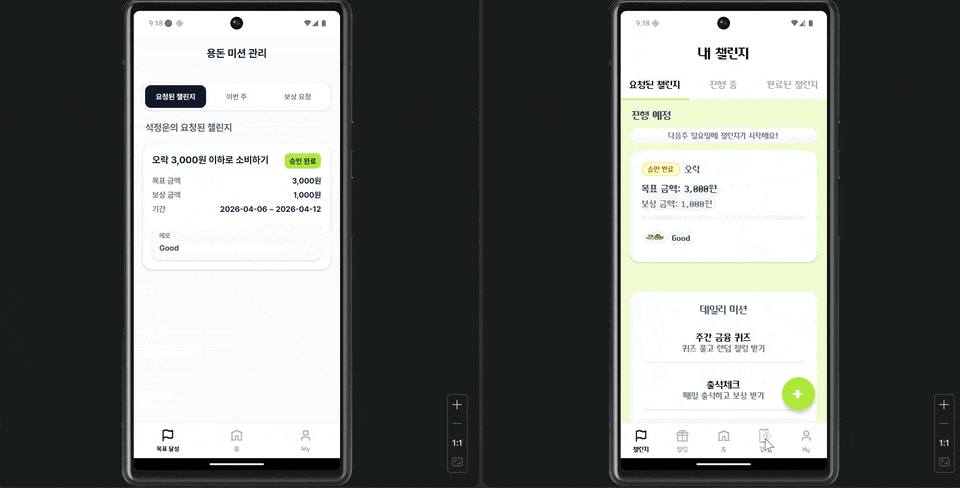
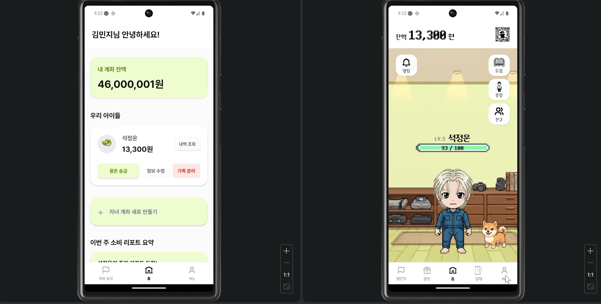
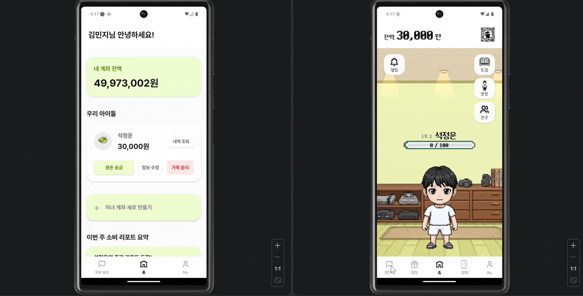
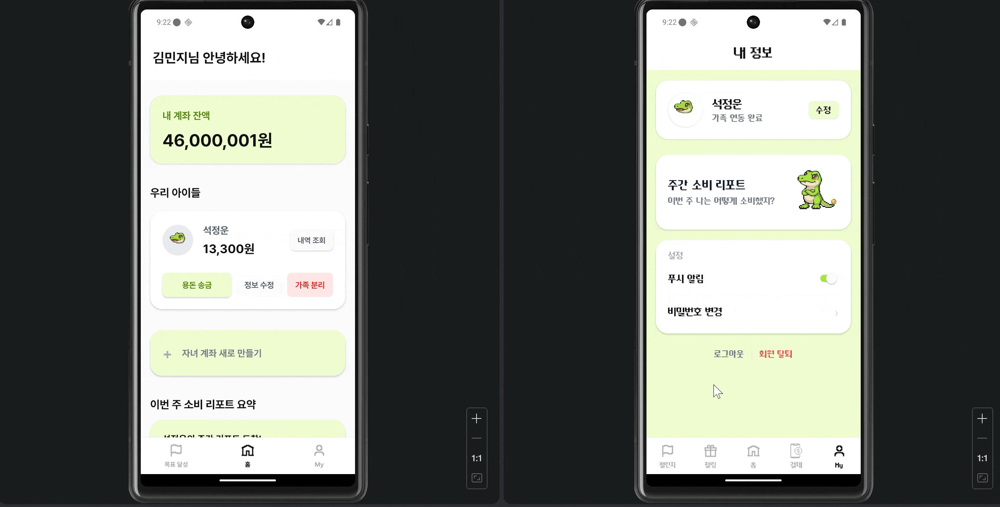
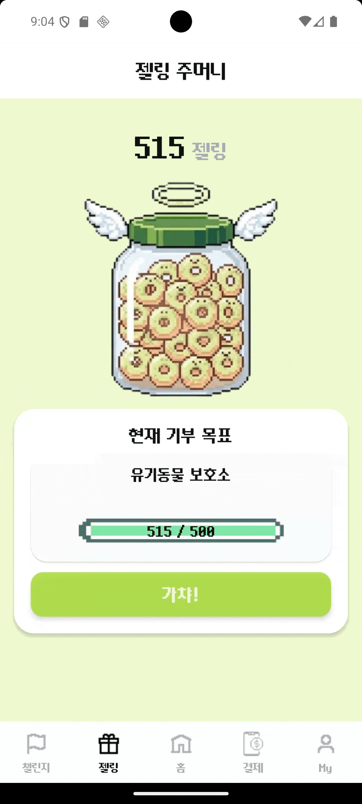
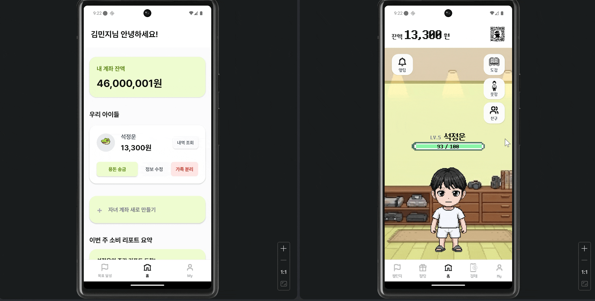
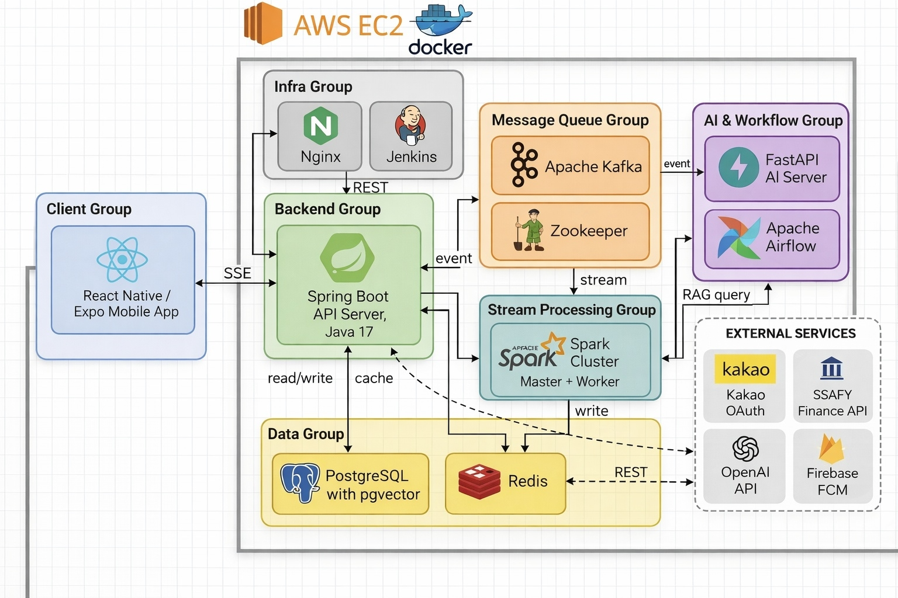

# 🪙 아꾸뱅꾸 (AKBK)

> *"내 소비습관이 만드는 또 다른 나"*
>
> *아이들은 어른들의 잔소리만으로 쉽게 습관이 형성되지 않습니다. 저희는 아바타 꾸미기와 금융 활동을 연결해, 아이들이 스스로 즐겁게 소비습관을 만들어갈 수 있도록 돕습니다.*

 

**아꾸뱅꾸(AKBK)** 는 **주도적인 소비습관 형성을 돕는 핀테크 서비스**입니다.  
아이들은 미션과 금융 활동을 통해 포인트를 모으고, 이를 아바타 꾸미기에 활용하며 자연스럽게 올바른 소비습관을 익힐 수 있습니다.  
보호자와 아이가 함께 성장 과정을 확인할 수 있도록, 재미와 금융 교육을 연결한 경험을 제공합니다.

 

## 기획 배경
### 기획 의도 및 기대효과
+ **배경**
  
+ **목표**

 

## 🔎 아꾸뱅꾸 기능 살펴보기
### 결제

  

### 리포트 

  

### 용돈챌린지
> 아이가 부모님께 이번주 용돈을 요청하는 기능으로, 주도적인 소비 습관 향상을 지원합니다

용돈챌린지 제안하기

  

완료된 용돈챌린지 처리 요청

  

### 금융 챗봇
> 금융 특화 챗봇과 대화를 통해, 기부 포인트(젤링)을 쌓아 기부 실천의 쀼ㅜ듯함?도 금융/경제 지식도 얻어용

  

### 기부하기
> 금융챗봇과 결제 캐시백으로 쌓은 아부뱅구 만의 젤링으로 기부를 실천해요

  

### 아바타 꾸미기
> 우리 아꾸뱅꾸만의 차별점! 자랑! 아바타를 꾸며봐

  

## 🏗 통합 서비스 아키텍처

  

## 📄 ERD

## 📑 기술개발문서

## 👥 협업 컨벤션 
### Git 협업
- [브랜치 → 커밋/PR WorkFlow](https://typhoon-frog-87b.notion.site/PR-WorkFlow-3043787210e48107b526d576ea20dc6e?source=copy_link)
- [Branch 전략](https://typhoon-frog-87b.notion.site/Branch-3043787210e481cab60fe3d648a8d67a?source=copy_link)
- [Git 커밋 컨벤션](https://typhoon-frog-87b.notion.site/Git-3043787210e481bfac97dce6b2a2923c?source=copy_link)
- [Pull Request 전략](https://typhoon-frog-87b.notion.site/Pull-Request-3043787210e481ccbd06e75d5bb6e9f3?source=copy_link)
### 팀 협업
- [Jira 이슈 컨벤션](https://typhoon-frog-87b.notion.site/Jira-3043787210e48126a676dbcb1298bfc7?source=copy_link)
- [그라운드 룰](https://typhoon-frog-87b.notion.site/3043787210e48162ae67c6396bdf38c7?source=copy_link)
- [기술 문서 작성 룰](https://typhoon-frog-87b.notion.site/3043787210e481c696f0d8f858b28590?source=copy_link)

## 💁‍♂️ 프로젝트 팀원
| **Frontend** | **Backend** | **Backend** | **AI/DE** | **AI/DE** | **AI/Infra** |
|:---:|:---:|:---:|:---:|:---:|:---:|
|  |  |  |  |  |  |
| [석정운](https://github.com/jeongunun) | [유소민](https://github.com/SoMin-Yoo) | [김민정](https://github.com/minjeongkimm) | [김휘민](https://github.com/Dae12-Han) | [박사랑](https://github.com/sweetpotatolove) | [임선우](https://github.com/Thedduro) |